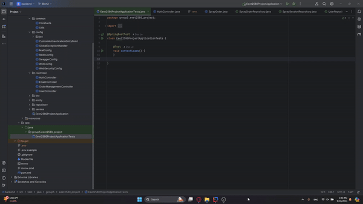

# EEET2580 - Project - Group 5

## Frontend

- Languague: JavaScript, Library: ReactJS + Vite

## Backend

- Languague: Java, Framework: Spring Boot

## Development

### Prerequisites

- NodeJS
- Java JDK 22
- Docker
- MySQL 8.0 (optional)
- Redis (optional)

### Environment Variables

- Create .env file from the example template

```bash
cp .env.example .env
```

- do the same for each service if you want to test locally (without docker)

```bash
cp ./backend/.env.example ./backend/.env
cp ./frontend/.env.example ./frontend/.env
```

- Configure the environment variables as you see fit

- Add environment variables to project in IntellJ IDEA
- 


### Deployment

#### Docker

```bash
docker-compose up -d
```

#### Local

1. Database and Cache

- for Mac Silicon:

```bash
docker-compose up -d service-db service-redis
```

- for Mac Intel and Window PCs:

```bash
docker compose up -d service-db service-redis
```

2. Backend

   - Make sure your database and cache docker services are up
   - Make sure the .env variables are configured correctly
   - Build via Intellij IDEA run

3. Frontend

```bash
cd frontend
npm i
npm run dev
```

### Swagger UI

- [Backend Service](http://localhost:8080/swagger-ui/index.html)
